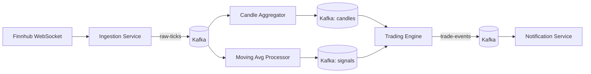

# TickerFlow

Event-driven stock market data pipeline. Live price ticks → Kafka → stream processing → simulated trading signals.

Built as a portfolio project to demonstrate production-grade backend architecture: event-driven microservices, stream processing, and cloud deployment on AWS.

## What it does

1. **Ingestion Service** connects to a live market data WebSocket (Finnhub) and publishes raw price ticks to Kafka.
2. **Stream Processing** consumes ticks and computes OHLC candles (1m/5m/1h windows) and moving averages (SMA/EMA) in real time.
3. **Trading Engine** consumes signals (e.g. moving-average crossovers) and executes simulated ("paper") trades, tracking a virtual portfolio and P&L.
4. **Notification Service** consumes trade/alert events and routes them out (email, webhook, etc).



## Why it's built this way

- **Event-driven, not request/response** — services never call each other directly; everything flows through Kafka topics.
- **Saga pattern** — trade execution is a chain of events with compensating actions on failure, not a distributed transaction.
- **Outbox pattern** — avoids the dual-write problem between a service's DB and its Kafka publish.
- **Idempotent consumers** — Kafka is at-least-once delivery, so every consumer dedupes on event ID.
- **Schema registry (Avro)** — versioned, enforced event contracts between services.

## Tech Stack

- **Language/Framework:** Java, Spring Boot
- **Streaming:** Apache Kafka, Kafka Streams
- **Storage:** PostgreSQL (per-service schema)
- **Local dev:** Docker Compose
- **Cloud (phase 2):** AWS MSK, ECS Fargate, RDS, Terraform/CDK
- **Data source:** [Finnhub](https://finnhub.io) WebSocket API (free tier)

## Status

🚧 Early scaffolding. Build order:

- [ ] Docker Compose environment (Kafka, Postgres)
- [ ] Ingestion Service (Finnhub → Kafka)
- [ ] Candle aggregation (Kafka Streams)
- [ ] Moving average + crossover signals
- [ ] Paper trading engine + outbox pattern
- [ ] Notification service
- [ ] Schema registry (Avro)
- [ ] AWS deployment (MSK, ECS, RDS, IaC)
- [ ] Observability (CloudWatch, X-Ray)

## Local Development

```bash
docker compose up -d
```

(Compose file coming in the next phase.)

## Architecture Decisions

Design rationale and trade-offs will be documented in `/docs/adr` as the project progresses.
