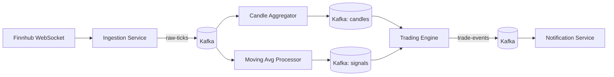

# TickerFlow

Event-driven stock market data pipeline. Live price ticks → Kafka → stream processing → simulated trading signals.

Built as a portfolio project to demonstrate production-grade backend architecture: event-driven microservices, stream processing, and cloud deployment on AWS.

## What it does

1. **Ingestion Service** connects to a live market data WebSocket (Finnhub) and publishes raw price ticks to Kafka.
2. **Stream Processing** consumes ticks and computes OHLC candles (1m/5m/1h windows) and moving averages (SMA/EMA) in real time.
3. **Trading Engine** consumes signals (e.g. moving-average crossovers) and executes simulated ("paper") trades, tracking a virtual portfolio and P&L.
4. **Notification Service** consumes trade/alert events and routes them out (email, webhook, etc).



## Why it's built this way

- **Event-driven, not request/response** — services never call each other directly; everything flows through Kafka topics.
- **Saga pattern** — trade execution is a chain of events with compensating actions on failure, not a distributed transaction.
- **Outbox pattern** — avoids the dual-write problem between a service's DB and its Kafka publish.
- **Idempotent consumers** — Kafka is at-least-once delivery, so every consumer dedupes on event ID.
- **Schema registry (Avro)** — versioned, enforced event contracts between services.

## Tech Stack

- **Language/Framework:** Java, Spring Boot
- **Streaming:** Apache Kafka, Kafka Streams
- **Storage:** PostgreSQL (per-service schema)
- **Local dev:** Docker Compose
- **Cloud (phase 2):** AWS MSK, ECS Fargate, RDS, Terraform/CDK
- **Data source:** [Finnhub](https://finnhub.io) WebSocket API (free tier)

## Status

Local pipeline complete and working end-to-end. AWS deployment is phase 2.

- [x] Docker Compose environment (Kafka in KRaft mode, Postgres)
- [x] Ingestion Service (Finnhub WebSocket → Kafka `raw-ticks`)
- [x] Candle Aggregator (Kafka Streams — 1m/5m/1h OHLC windows)
- [x] Moving Average Processor (Kafka Streams — SMA-20/50 crossover signals)
- [x] Trading Engine (paper trades, transactional outbox, choreography saga)
- [x] Notification Service (Kafka consumer → email via Mailgun SMTP)
- [ ] Trade P&L — open_price/close_price/pnl columns, calculate on position close
- [ ] Schema Registry (Avro — versioned event contracts, replace JSON)
- [ ] AWS deployment (MSK, ECS Fargate, RDS, Terraform)
- [ ] Observability (CloudWatch, X-Ray)

## Local Development

Prerequisites: Docker Desktop, Java 21

```bash
# Start Kafka (KRaft mode) and Postgres
docker compose -f infra/docker/docker-compose.yml up -d

# Start services (each in its own terminal or IntelliJ run configuration)
# Order: ingestion → candle-aggregator → moving-avg-processor → trading-engine → notification-service
```

Services connect to:
- Kafka: `localhost:9092`
- Postgres: `localhost:5433` (mapped to avoid conflict with local Postgres on 5432)

## Architecture Decisions

- **Outbox pattern** over dual-write: DB write and Kafka publish in one transaction; a poller publishes unpublished rows. Eliminates the window where a crash leaves DB and Kafka out of sync.
- **Choreography saga** over orchestration: no central coordinator; each service reacts to events and emits its own. Looser coupling, no single point of failure.
- **Kafka Streams** over consumer loop for aggregation: stateful operators (windowed aggregation, joins) with built-in fault tolerance via RocksDB changelog topics.
- **Schema-per-service Postgres**: each service owns its schema, enforcing that services never share tables or bypass the event bus.
